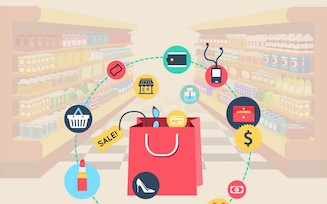

# Instacart Market Basket Analysis
Author: **Brandon Menendez**

## Business Problem 
>"*Online grocery shopping in the U.S. trails that of other e-commerce categories in large part because our grocery shopping habits are so deeply ingrained, and online grocery retailers haven't yet convinced customers that grocery shopping online can be a better experience*"    
> -Stephen Caine, Bain & Company

When the COVID-19 pandemic hit, many Americans opted to stay in their homes and order groceries online rather than go in person to their local grocery store. A [nationally representative survey](https://academic.oup.com/cdn/article/5/Supplement_2/231/6293076?login=false) found that **34%** of households reported grocery shopping online more since the beginning of the pandemic and **60%** of these households planned to continue shopping online after the pandemic ends. 

This sudden increase in customer's shopping online was a major tailwind for online grocers. But just as important as customer acquisition is for these companies, so is customer retention. Like the classic saying goes, "Old habits die hard" and online grocers need to ensure they are utilizing their technology to provide a more convenient shopping experience in order to hold on to those customers deciding to shop online rather than in-store. There are three major tools that all online grocers can utilize in an attempt to retain customers gained during the pandemic:

1. **Merchandising:** (blurb about Merchandising)
2. **Recommendations:** (blurb about recommendation)
3. **Coupons & Promotios:** (blurb about coupons and promotions)

Instacart is a grocery ordering and delivery app, which has over 500 million products available across 40,000 grocery stores in the United States & Canada. Instacart provides a convenient customer experience, which is largely focused around product recommendations based on past purchases. In addition to recommendaiton widgets  (Add to Cart, Frequently bought together etc), Instacart also works with retailers to provide targeted promotions and coupons to its customers. 

**Objective:**  
Using over 3M rows of customer order data provided by Instacart, I will be performing a market basket analysis and implement predictive modeling  to:

1. Identify frequent items sets and association rules to better inform merchandising, customer recommendations and promotional stategies for Instacart  
2. Predict ahead of time which items will be re-ordered by a particular customer

Using the insights gained from this analysis, I will provide recommendations for how Instacart can improve their merchandising, recommendation and promotional strategy in an effort to maintain customers for the long-term.

## Data Understanding 
The data for this project was released by Instacart in 2017 as part of their [3 Million Instacart Order Competition](https://tech.instacart.com/3-million-instacart-orders-open-sourced-d40d29ead6f2).

The provided anonymized dataset contains a sample of over 3 million customer orders, inclusive of over 49 thousand unique products and 200 thousand unique customers. For each user, Instacart provided between 4 and 100 of their orders, with the sequence of products purchased in each order. They also provide the week and hour of day the order was placed, a relative measure of time between orders and product attributes.

For this analysis I will be utilizing the following tables:
   - **orders** - Indicates which evaluation set an order belongs too  
   - **orders_prior** - Contains previous order contents for all customers. 'reordered' indicates that the customer has a previous order that contains the product
   - **products** - Provides additional information about the products ordered, including product name, department, and aisle
   - **aisles** - Contains attributes about aisles
   - **departments** - Contains attributes about departments 

## Methods 
1. Apriori Algorithm - Association rule mining & frequent item sets.
2. Logistic Regression - Binary classification model for predicting whether or not a customer will reorder a product.
3. XBoost Model - Classification model to identify future re-orders from existing customers. 

## Results 
Confidence - 

Lift - 

Support - 

Model Results - 

## Conclusion 

## Future Steps 
1. Markdowns and excess inventory 
2. Display Ad Opportunity Cost 
3. Basket Margin Optimization 
4. Reviews & Ratings 

## For More Information
Please refer to the [EDA](https://github.com/brandmend/Instacart_Basket_Prediction_Analysis/blob/main/Instacart_Basket_Analysis_EDA_LogReg.ipynb) & [Apriori](https://github.com/brandmend/Instacart_Basket_Prediction_Analysis/blob/main/Instacart_Basket_Analysis_Apriori.ipynb) Jupyter Notebooks or the presentation.

For additional information, please contact Brandon Menendez at [bmenendez94@gmail.com](bmenendez94@gmail.com) or on [LinkedIn](http://linkedin.com/in/brandon-menendez/) 

## Repository Structure 
> - images
> - Instacart_Basket_Analysis_EDA_LogReg.ipynb
> - presentation
> - README.md
